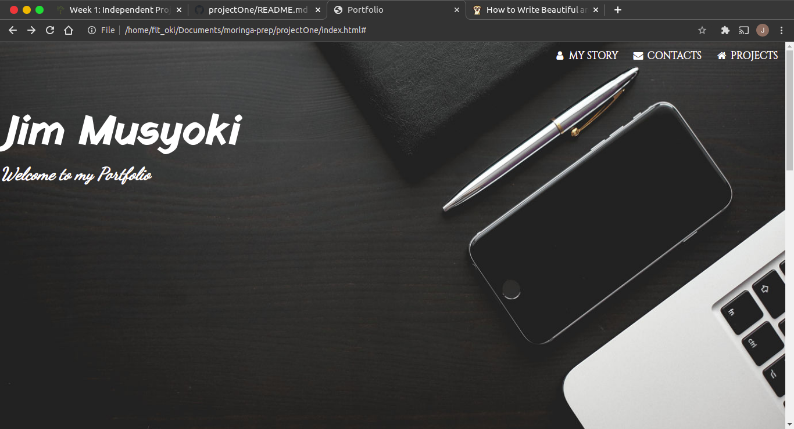
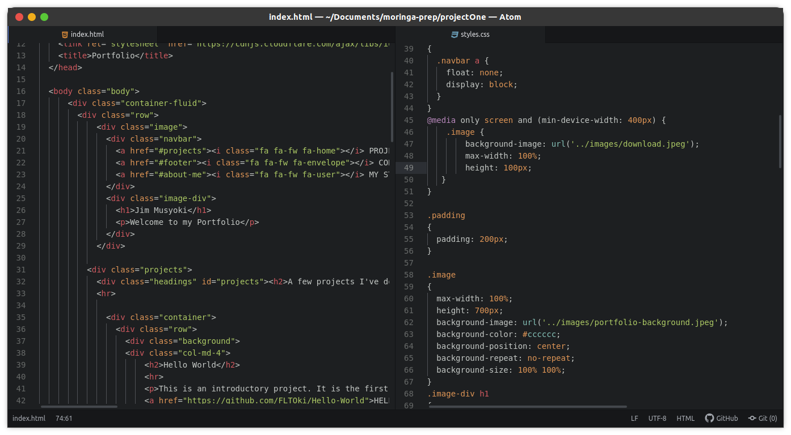

# My Portfolio

  

  <h3 align="center">PORTFOLIO</h3>
  

    This is my personal portfolio.
     
     
     
    <a href="fltoki.github.io/projectOne">View Demo</a>
    ·
    <a href="#">Report Bug</a>
    ·
    <a href="#">Request Feature</a>
  

## Author
Built by: Musyoki Jim.

## About The Project

It contains my background information, skills and hobbies and a few on the projects I have previously worked on. This is my first project as a student of Moringa School and I hope to build more and better ones.

### Built Using
I used the following resources in its development
* [Bootstrap](https://getbootstrap.com)
* [HTML](https://html.com)
* [CSS](https://css.com)

# License
Distributed under the MIT License. See `LICENSE` for more information.

## Contact
* Jim Musyoki - [Email:](musyokijim@gmail.com)
* Project Link: [Portfolio link](fltoki.github.io/projectOne)
